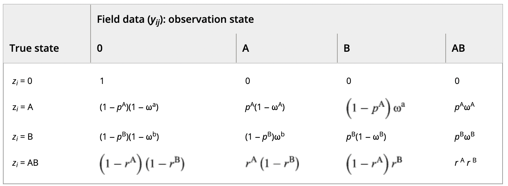
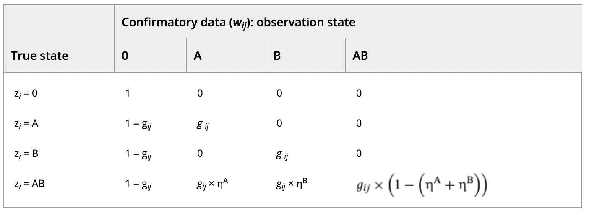

```{r setup, include = FALSE}
rm(list = ls())

library(knitr)
hook_chunk <- knitr::knit_hooks$get('chunk')
knit_hooks$set(chunk = function(x, options) {

  # add latex commands if chunk option singlespacing is TRUE
  if(isTRUE(options$singlespacing)){
    return(sprintf("\\singlespacing\n %s \n\\doublespacing", hook_chunk(x, options)))
  } else{
    return(hook_chunk(x, options))
  }
})
knitr::opts_chunk$set(
  fig.align = "center",
  tidy = T,
  singlespacing = TRUE,
  cache = FALSE,
  fig.dim = c(10,8),
  message = FALSE,
  warning = FALSE,
  comment = NA,
  echo = F
)


# packages
packs <- c("dplyr", "nimble", "htmltools", "ggplot2", "sf", "Rcpp", "RcppArmadillo", "inline", "mvtnorm", "readr", "parallel", "xtable", "rstan", "coda", "vegan", "tidyr", "stringr", "scatterplot3d", "plotly", "tidyverse", "ggalluvial", "lubridate", "MASS", "arm")
sapply(packs, require, character.only = T)
rm(packs)
options(tidyverse.quiet = TRUE)

# convenience
`%notin%` <- Negate("%in%")

# stan settings
options(mc.cores = parallel::detectCores() - 1)
rstan_options(auto_write = TRUE)
```

# Annotated Bibliography 

## 2017 

### [@ga17b] Dealing with false-positive and false-negative errors about species occurrence at multiple levels

#### Summary 

The authors develop a false-positive occupancy model that has multiple stages. 
The motivating example is use of eDNA gathered from water and analyzed via PCR to determine the presence or absence of a species of interest. 
At each site, the species may or may not be present, its eDNA may or may not be available for detection, and the lab equipment may or may not detect the eDNA. 
This example assumes that multiple primary and secondary sampling occasions are used in the design (e.g., multiple water samples from multiple visits to a site). 
After discussing identifiability in models such as these, the authors investigate which sources of auxiliary data are most useful for identifying parameters, comparing unambiguous detections (U), calibration experiments across the two stages (C1) and calibration experiments at the lower stage (detection level). 
This auxiliary information is incorporated into the likelihood via the extended model below. 
The authors apply their extended model to an eDNA survey of four frog species, where aural surveys were included as unambiguous detections; results indicate that combining unambiguous data with calibration data for $p_{10}$ or using both sources of calibration data were sufficient for identifying the model. 
The authors conclude with a discussion of future applications, connections to existing models, and the advantages of using profile likelihoods to characterize uncertainty and and find multimodality in the likelihood function. 

#### Model specification 

Let 

* $\psi$ denote occupancy of the focal species.
* $\theta_{11}$ denote the probability that the species is "available for detection", given that it is present.
* $\theta_{10}$ denote the probability that the species is "available for detection", given that it is *not* present. This might happen in eDNA through contamination of equipment in the field. 
* $p_{11}$ denote the probability that the species is detected, given that it is available for detection.
* $p_{10}$ denote the probability that the species is detected, given that it is not available for detection. 

Then, the likelihood  of the "core model" may be written as 
\[
L = \prod_i \left[\psi_i \left(\prod_j \left(\theta_{11} \prod_l^{L_{ij}} p_{11}^{d_{ijl}} (1- p_{11})^{1 - d_{ijl}} + (1-\theta_{11})  \prod_l^{L_{ij}} p_{10}^{d_{ijl}} (1- p_{10})^{1 - d_{ijl}} \right)\right) + (1-\psi_i) \left(\prod_j \left(\theta_{10} \prod_l^{L_{ij}} p_{11}^{d_{ijl}} (1- p_{11})^{1 - d_{ijl}} + (1-\theta_{10})  \prod_l^{L_{ij}} p_{10}^{d_{ijl}} (1- p_{10})^{1 - d_{ijl}} \right)\right)\right],
\]

where $d_{ijl}$ is the detection/non-detection of the focal species on secondary sampling occasion $l$, primary sampling occasion $j$ to site $i$. $L_{ij}$ is the number of secondary sampling occasions at site $i$ on primary sampling occasion $j$. 

For the extended model, the bernoulli trials for detections within secondary sapling occassions $l$ are collapsed to binomial random variables so that $d_{ij}$ in the extended model is the sum of $d_{ij}$ values in the core model above. The extended model requires additional notation to describe the joint likelihood of both auxiliary and experimental data. Let 

* $K_i$ be the number of replicates used with the unambiguous method 
* $\delta_i$ be the number of detections from the unambiguous method
* $r_{11}$ denote the probability of detection with the unambiguous method
* $V^{c1}$ denote the the number of trials in the calibration experiment at the level of the primary sampling occasion. 
* $L_{j}^{c1}$ and $d_j^{c1}$ denote the number of replicates and detections, respectively, in a "blank" water sample $j$ (i.e., in the primary sampling occasion). 
* $L^{c2}$ and $d^{c2}$ denote the number of blanks and detections in the calibration experiment at the secondary sampling level. In the eDNA example, these are the number of blank PCRs and detections within a water sample. 

With this notation, the extended model that accommodates auxiliary data has the likelihood \[
L = \prod_i \left[\psi_i \left( \prod_j^{V_i} \left( \theta_{11} p_{11}^{d_{ij}}(1 - p_{11})^{L_{ij} - d_{ij}} + (1 - \theta_{11}) p_{10}^{d_{ij}}(1 - p_{10})^{L_{ij} - d_{ij}}
\right) 
\right) \{r_{11}^{\delta_i}(1 - r_{11})^{K_i - \delta_i}\} + \\ 
(1- \psi_i) \left(
\prod_j^{V_i} \left( \theta_{10} p_{11}^{d_{ij}}(1 - p_{11})^{L_{ij} - d_{ij}} + (1 - \theta_{10}) p_{10}^{d_{ij}}(1 - p_{10})^{L_{ij} - d_{ij}}
\right)
\right) \{0^{\delta_i}\}
\right] \times \\
\prod_{j = 1}^{V^{c1}} \left( 
\theta_{10} p_{11}^{d_j^{c1}}(1-p_{11})^{L_j^{c1} - d_j^{c1}} + (1- \theta_{10})p_{10}^{d_j^{c1}}(1-p_{10})^{L_j^{c1} - d_j^{c1}}
\right) \times \\
\left[
p_{10}^{d_j^{c2}}(1-p_{10})^{L^{c2} - d^{c2}}
\right]
\]

A more intuitive way of writing the extended model is hierarchically: 

\[
z_i^1 \sim Bernoulli(\psi_i)\\
z_{ij}^2 \sim Bernoulli(z_i^1 \theta_{11} + (1-z_i^1)\theta_{10})\\
d_{ij} \sim Binomial(L_{ij}, z_{ij}^2 p_{11} + (1- z_{ij}^2) p_{10})\\
\delta_i \sim Binomial(K_i, z_i^1 r_{11})\\
z_j^{2, c1} \sim Bernoulli(\theta_{10})\\
d_j^{c1} \sim Binomial (L_j^{c1}, z_j^{2,c1} p_{11} + (1 - z_j^{2,c1})p_{10})\\
d^{c2} \sim Binomial (L^{c2}, p_{10})
\]


#### Notes 

* The authors introduce the profile log-likelihood and use it for estimation. The profile likelihood is described by the authors as (for some parameter $\phi$ in the model) "the value of the likelihood function for each value of $\phi$ maximized with respect to the other parameters. 
* This study was conducted entirely within an MLE framework, but the authors acknowledge that it is possible to identify parameters using prior knowledge in a Bayesian paradigm. 

### [@ga17] Species occupancy estimation and imperfect detection: shall surveys continue after the first detection?

#### Summary 

The authors compare a removal design (where sites are no longer visited after first detection of the focal species) to a standard design in an occupancy modeling framework. 
The authors do so first by assessing relative efficiency (in terms of the ratio of RMSE for the two designs) when occupancy and detection probabilities are assumed constant. 
Under these constraints, they find that the removal design is more efficient when the detection probability and number of visits made to a site are not small, and when conditions are optimal; if these requirements are not satisfied, the standard design performs better. 
When assuming constant occupancy and detection probabilities, the authors use simulation to investigate the impacts of decreased survey effort, finding that the removal design is much more sensitive. 
When occupancy and detection probabilities are heterogeneous, the authors find that analytically, bias is identical for the two designs. 
Simulations indicate that in the presence of unmodelled detection probability heterogeneity, the standard design outperforms the  removal design when cumulative detection probability is not nearly 1. 
If the heterogeneity *is* modelled, however, the standard design outperforms the removal design because it provides more opportunities to gather covariate information to model the heterogeneity.

#### Model Specification 

Let $\psi$ denote the probability that site $i$ is occupied by the focal species, and let $p_i$ denote the probability of detecting the focal species at an occupied site $i.$ Furthermore, let 

* $S$ denote the number of sites sampled
* $S_d$ denote the number of sites where a detection occurred 
* $K_i$ denote the number of visits to made to site $i.$ Under the removal design, this is a random variable.
* $K_M$ denote the designed number of visits to each site
* $d_i$ denote the number of detections at site $i$
* $p_i^\star$ denote the cumulative probability of a detection after $K_M$ visits ($p_i^\star = 1 - (1-p_i)^{K_M}$)
* $n_1$ denote the total number of detections
* $n_0$ denote the number of non-detections


Under the standard occupancy model, the likelihood is 

\[
\mathcal{L}(\boldsymbol{\psi}, \boldsymbol{p}) = \prod_{i = 1}^S \left[ \psi_i p_i^{d_i} (1-p_i)^{K_i - d_i} + I(d_i = 0)(1-\psi_i) \right].
\]

For the removal design, and assuming that $\psi$ and $[$ are constant, the likelihood can be rewritten as

\[
\mathcal{L}(\psi, p) = \psi^{S_d} p^{n_1} (1-p)^{n_0 - (S-S_d)K_M} (1 - \psi p^\star)^{S - S_d}
\]


## 2018 

### [@chambert18] A new framework for analysing automated acoustic species detection data: Occupancy estimation and optimization of recordings post-processing

#### Summary 

The authors propose framework that models partially-observed occupancy states with information from both binary and count detections; a subset of automatically labeled recordings are manually vetted and modeled using a hypergeometric distribution. 
The authors demonstrate this model's properties through simulation and compare the full model against two reduced models that use either solely binary detection information or solely count detection information. 
The authors find that the general model performed better than either reduced model and that the reduced binary detection/non-detection model performed worst of the three considered in simulations. 
Applying the general model to tree frog datasets where all calls were evaluated to be either true or false positives, the authors found that the general model was sensitive to outlier sites but was able to provide fairly accurate and precise estimates for occupancy probabilities when a greater proportion (12.5% and 5% (after outlier removal) for the two datasets respectively) of calls were evaluated as true- or false-positive detections. 


#### Model specification 

Let $i$ index site and $j$ index visit. Then assume that 

* $z_i$ is the occupancy status of site $i$ 
* $\psi_i$ is the probability that site $i$ is occupied 
* $y_{ij}$ is the binary detection/non detection observation recorded for site $i$ and visit $j$.  
* $p_i$ is the probability of detection at site $i$ 
* $p_{11}$ is the probability that the focal species is detected at a site given that it is present. 
* $p_{10}$ is the probability that a detection is recorded, given that the focal species is not present. 

Then the false-positive occupancy portion of the model is written as


\[
z_i \sim Bernoulli(\psi_i)\\
[y_{ij}|z_i] \sim Bernoulli(p_i)\\
p_i = z_ip_{11} + (1-z_i)p_{10}\\
\]

For sites with at least one detection, let 

* $N_i$ denote the total number of detections at site $i$. 
* $K_i$ denote the number of true detections at site $i$. 
* $Q_i$ denote the number of false-positive detections at site $i$ 
* $\lambda$ be the expected number of true calls from the focal species
* $\omega$ be the expected number of false-positives, which are attributed to some exogenous, omnibus source [as opposed to the presence of another species as in @wright20]. 
* $0 \leq n_i \leq N_i$ denote the subset of calls recorded at site $i$ that are validated.
* $k_i \leq n_i$ denote the number of true positive recordings from the focal species. 

Then, the count detection and validation process is modeled as: 

\[
N_i \sim Poisson(\lambda * z_i + \omega)\\
K_i \sim Poisson(\lambda z_i)\\
Q_i = N_i - K_i\\
k_i \sim Hypergeometric(K_i, N_i, n_i)
\]

#### Notes 

* This is a single-species model, as opposed to the multi-species model of @wright20
* A subset of calls are validated at a visit, in contrast with the assumption made by @wright20 and @stratton22 

### [@chambert18b] Two-species occupancy modelling accounting for species misidentification and non-detection

#### Summary 

The authors develop a general approach to modeling false-positive errors when those false-positive error rates for one species are dependent on the presence of another. 
The model that they propose considers two structures in how the two species interact in patterns of occurrence and co-occurrence : general and 'dominance' based interaction. 
@chambert18b conduct a simulation study to investigate the influence of validation effort, which they call the proportion of confirmatory data (PCD). 
In simulations, the model was able to recover parameters well (even for low PCD), but precision increased as PCD increased. 
The authors also compared the performance of their model against the existing single-species model of Miller et al., (2011) (not included here). 
The authors applied their model to two closely-related species of salamander where prior knowledge suggested a dominance interaction may be present. 
In application to real data, the authors used the dynamic, multi-season model given in the appendix, but needed to reparameterize the model under the assumption that $r = p$ for both species (i.e., detection is independent of whether the other species is present) to obtain estimates and standard errors for several parameters. 

#### Model specification 

Let $i$ index site, and $j$ index visit. Then let 

* $y_{ij}$ denote the field observation that takes on value A if only species A is observed, B if only species B is observed, AB if both are observed, and 0 if neither A nor B are recorded. 
* $Z_{ij}$ denote the latent occupancy state. $Z_{ij}$ can take the same possible values as the field recordings: A, B, AB or 0. 

For the *general* model, let 

* $\psi^A_i$ and $\psi^B_i$ denote the unconditional probabilities of each species' occurrence at site $i$.  
* $\gamma$ define the 'species interaction factor' that takes on value $1$ if there is no interaction (occurrence is independent), values $<1$ if the two species tend to avoid one another, and values $>1$ when they tend to co-occur. 
* $\psi^{AB}_i = \psi^A_i \times \psi^B_i \times \gamma$ be the probability of occurrence
* $\Phi = \begin{bmatrix} 1 - \psi^A - \psi^B + \psi^{AB} \\ \psi^A - \psi^{AB} \\  \psi^B - \psi^{AB} \\ \psi^{AB} \\ \end{bmatrix}$ denote the vector of probabilities of occurrence. These are the probabilities of 0, A, B, and AB, respectively. 

For the *dominance interaction* model, occupancy of species A is independent of the presence or absence of the subordinate species B. Under this model, let 

* $\psi^A_i$ denote the unconditional  probability that the dominant species is present at site $i$
* $\psi^{B|a}$ be the conditional probability that species $B$ is present, given that A is absent. 
* $\psi^{B|A}$ denote the conditional probability that species $B$ is present given that $A$ is present. To be consistent with the general model, this can be rewritten as $\psi^{B|A} = \psi^{B|a} \times \gamma$
* $\gamma$ be the effect that the presence of species A has on the probability of presence for species B. $\gamma < 1 \implies$ negative effect, $\gamma = 1 \implies$ no effect and $\gamma >1 \implies$ a positive effect. 
* $\Phi = \begin{bmatrix} (1 - \psi^A)(1 - \psi^{B|a})\\ \psi^A (1 - \psi^{B|A})\\ (1- \psi^A) \psi^{B|a}\\ \psi^A \psi^{B|A}\end{bmatrix}$ denote the vector of state probabilities. The entries correspond to 0, A, B, and AB, respectively. 

For the observation processes in both models, let 

* $p^A$ denote the probability of correctly detecting species A at a site where it is truly present.
* $r^A$ denote the probability of correctly detecting species A at a site where both species are present.
* $\omega^A$ denote the probability of recording a false-positive detection for species **B**, given that only species A is present, *and* other detections at the site visit have already correctly identified species A. 
* $\omega^a$ denote the probability of recording a false-positive detection for species B, given that only species A is present and other detections at the site visit have *not* already correctly identified species A. 
* $\Pi_z$ denote the probability vector corresponding to true occupancy state $z.$

With this notation, the two-species occupancy model is 
\[
Z_i \sim Multinomial(\Phi)\\
y_{ij}|z_i \sim Multinomial(\Pi_{z_i}) \\
\]

with $\Pi_{z_i}$ specified as below, depending on the true state $z_i$: 

```{r}

```

For confirmatory data, let $w_{ij}$ denote the state of confirmed data. 
Then $w_{ij} \in \{0, A, B, AB\}$, with $0$ corresponding to sites where either $y_{ij} = 0$ or no individuals were selected for confirmation. 
The PCD is given by $$PCD = \frac{\sum_i \sum_j I(w_{ij} \neq 0)}{\sum_i \sum_j I(y_{ij}\neq 0)}.$$ 
To distinguish sites where $w_{ij} = 0$ from ones where $w_{ij} \neq 0$, the authors introduce yet another variablem, $g_{ij}$, which is just $w_{ij}$ collapsed to a binary variable. 
Finally, they introduce the parameter $\eta^k, k\in\{A, B\}$ to be the probability that only species $k$ is confirmed at a site where both are present. 
The probabilities associated with the confirmatory states $w_{ij}$ are given in the $\Omega$ matrix below: 

```{r}

```

With all of this notation, the likelihood can be written as 

\[
L(\boldsymbol{\theta}| \boldsymbol{h},\boldsymbol{g})  = \prod_{i = 1}^{I}Pr(h_i|g_i, \boldsymbol{\theta}),\\
Pr(h_i|g_i, \boldsymbol{\theta}) = \Phi \times \left[ \prod_{j = 1}^{J_i} (\Pi_{y_{ij}} \times \Omega_{w_{ij}}) \right],
\]

where $\Pi_{y_{ij}}$ and $\Omega_{w_{ij}}$ are column vectors in their respective matrices, and $\boldsymbol{\theta}$ is shorthand for all of the model parameters.  


#### Notes

* The confirmation process assumes that individuals are confirmed, so it is possible to have partial vetting at a site visit. 
* The appendix includes a multi-season extension 
* The model performed poorly for parameters near the boundary of the probability domain

## 2020

### [@wright20] Modelling misclassification in multi‐species acoustic data when estimating occupancy and relative activity

#### Summary 

Motivated by bat surveys that employ autonomous recording units (ARUs), the authors introduce a model capable of analyzing counts from multiple species simultaneously while accounting for false-positive detections that arise as a result of species misclassification. This approach expands on previously developed false-positive models; the authors use simulation to characterize model performance and to compare the performance of their model to these existing models, all of which use simplifying assumptions for analysis (e.g., counts summed to binary or data only from a single focal species). The authors then apply to count-detection model to bat ARU data from the Montana Natural Heritage Program.  

#### Model specification

Let $i = 1, 2, \dots, n$ denote site, $j = 1, 2, \dots, J$ denote visit, and $k = 1, 2, \dots, K$ denote species. Then, let 

* $Z_{ik}$ represent the latent, partially observed occupancy state of species $k$ at site $i.$
* $\psi_{ik}$ denote the probability that site $i$ is occupied by species $k.$ 
* $Y_{ijk}$ be the number of detections from species $k$ on visit $j$ to site $i.$ This is not directly observed in the presence of an imperfect classifier. 
* $\lambda_{ijk}$ denote the expected number of detections from species $k$ per visit to site $i.$
* $\theta_{k,k^\prime}$ denote the probability that the software classification algorithm classifies a call from species $k$ to species $k^\prime.$ These probabilities are organized into a confusion matrix $\Theta,$ where each row corresponds to the true species and each column to the ID label generated by the classifier. 
* $\boldsymbol{C}_{ijk}$ be a vector of length $K$ containing the counts attributed to each species by the classifier. This vector is directly observed. The elements of $\boldsymbol{C}_{ijk}$ are denoted as $C_{ijkk'},$ indicating the number of calls that are from species $k$ but were attributed to $k'.$ 
* $C_{ij. k^\prime}$ denote the total number of calls assigned species label $k'.$ These are the observed data and are ambiguous counts because they may contain calls that truly came from any of the $k$ species. 

The model is written as 
\[
Z_{ik} \sim Bernoulli(\psi_{ik}) \\
[Y_{ijk} | Z_{ik} = 1] \sim Poisson(\lambda_{ijk})\\
[\boldsymbol{C}_{ijk}| Z_{ik} = 1, Y_{ijk} = y_{ijk}] \sim Multinomial(y_{ijk}, \Theta)\\
C_{ij.k'} = \sum_{k = 1}^K{C_{ijkk'}}
\]

## 2021

### [@clare21] Generalized model-based solutions to false-positive error in species detection/nondetection data

#### Summary 

The authors seek to formulate a general model that accounts for false-positive detections and for which all existing model-based solutions to false-positive contamination are special cases. The authors' model specification is very simple, but some nuance is required to massage existing notation into the form of $\theta_{tp}$ and $\theta_{fp},$ which that authors do for three existing models in their lit review. The authors conduct a simulation study for two extensions: the RN (Royle-Nicols) and the PA (Phenological "arrival") models. The authors find that failing to account for false-positive detections led to large gains in relative bias in the RN model, even when the percent of detections that were FPs was low. The PA model performed similarly. 
Finally, the authors apply their model to Gray Fox data from Wisconsin, finding that when false-positive detections are ignored, estimated abundance across wide spatial extents is more than 3 times higher than when these false positives are accounted for. 

#### Model Specification 

A generalized model-based solution turns out to be anything that contains 
\[
y_{ij} \sim Bernoulli(\theta_{tp}\cup \theta_{fp}) 
\]
in the likelihood statement. In this formulation ,

$\theta_{tp}$ and $\theta_{fp}$ are the probabilities of true- and false-positive detections, respectively; $y_{ij}$ is a binary detection/nondetection from sampling occasion $j$ at site $i.$ 


## 2022

### [@spiers22] Estimating species misclassification with occupancy dynamics and encounter rates: A semi-supervised, individual-level approach

#### Summary 

The authors introduce a version of the count detection model proposed by @wright20 that exchanges the multinomial likelihood for a categorical distribution and models calls on an individual level. The authors also include elements of a dynamic occupancy model with terms for colonization and extinction and allow the confusion matrix to be rectangular to accommodate the possibility of a morphospecies designation (which leads to more possible species designations than species present). The authors fit the model to carabid beetle data where the imperfect classifier is a parataxonomist; they use these data to compare the performance of their model against a reduced, classification-only model without reference to occupancy dynamics. Finally, the authors conducted a simulation study similar to ours (2 species and 3 classification categories) and found only modest gains in performance as the level of validation effort increased. 

#### Model specification 

Let the indices be as for the count detection model of @wright20. Include a new index, $t = 1,2,3, \dots, T$ to indicate the season in which an observation was measured. Once the total number of individuals encountered, $L_{ij.t},$ is accounted for, let $l = 1,2,\dots,L_{ij.t}$ indicate the individual whose species label (either true or automatically identified) is being modeled.  

Under this model, let 

* $Z_{ikt}$ represent the latent, partially observed occupancy state of species $k$ at site $i$ during time $t.$
* $\psi_{ikt}$ denote the probability that site $i$ is occupied by species $k$ during season $t.$
* $\phi_{ikt}$ denote the probability that a species $k$ persists at site $i$ during time $t.$ 
* $\gamma_{ikt}$ denote the probability that a species colonizes a given site during time $t.$
* $\lambda_{ijk}$ denote the expected number of detections from species $k$ per visit to site $i.$
* $\theta_{k,k^\prime}$ denote the probability that the software classification algorithm classifies a call from species $k$ to species $k^\prime.$ These probabilities are organized into a confusion matrix $\Theta,$ where each row corresponds to the true species and each column to the ID label generated by the classifier. 
* $L_{ijkt}$ denote the total number of individuals of species $k$ encountered of visit $j$ to site $i$ during time $t.$ Note that when there is imperfect classification of individuals these counts are not directly observed. The sum over species, $L_{ij.t}$ is the total number of individuals encountered on a given survey to a site and *is* observable. 
* $y_{ijlt}$ denote the imperfect classification of individual $l$ encountered at site $i,$ visit $j,$ season $t.$
* $k[ijlt]$ denote the partially observed (for confirmed individuals) true species label of individual $l$ at a given site-visit during season $t.$ 
 

\[
z_{ikt} \sim  Bernoulli(\psi_{ikt})\\
\psi_{ikt} = z_{i,k,t-1}\phi_{i,k,t-1} + (1-z_{i,k,t-1})\gamma_{i,k,t-1}\\
L_{ij.t} = \sum_{k=1}^{K}L_{ijkt} \sim Poisson \left(\sum_{k=1}^{K}z_{ikt}\lambda_{ikt}\right)\\
y_{ijkt} \sim Categorical(\theta_{k[ijlt]})\\
k[ijlt] \sim Categorical \left( \frac{z_{ikt}\lambda_{ikt}}{\sum_{k=1}^Kz_{ikt}\lambda_{ikt}} \right)
\]


#### Notes 

* Simulation study used data-generating values that were randomly generated from the priors used during the case study. 
  * This may not be intentional, but this approach introduces the assumption that the distribution for $\psi_k$ is mound-shaped, symmetric with mean/median near 0.5, regardless of site. 
  *  The simulated values used in the following figure were generated using code from the `simulation.R` file on the authors' Zenodo page. 
  
```{r}
set.seed(123)
full_df <- data.frame()

for(iter in 1:1000){
  mu_spec <- rnorm(2, 0, 1)
  mu_site <- c(0,0)
  
  nsite <- 30 #number of sites
  nsurv <- 3  #number of surveys in the season
  K_imp <- 3  #number of states identified by imperfect classifier
  K_val <- 2   #number of states identified in validation
  
  R <- diag(rep(1, 2)) # 2 dim since we're estimating psi and lambda
  Tau_spec <- Tau_site <- rWishart(n=1, df=10, Sigma=R)             ## Jacob's comment: are Tau_spec and Tau_site always supposed to be = ? 
  eps_spec <- mvrnorm(n=K_val, mu=mu_spec, Sigma=solve(Tau_spec[,,1], R) )
  eps_site <- mvrnorm(n=nsite, mu=mu_site, Sigma=solve(Tau_site[,,1], R) )
  
  psi <- lambda <- matrix(NA,nrow=nsite,ncol=K_val)
  
  for (i in 1:nsite){
    for (k in 1:K_val) {
      psi[i, k] <- invlogit(eps_site[i, 1] + eps_spec[k, 1])
      lambda[i, k] <- exp(eps_site[i, 2] + eps_spec[k, 2])
    }
  }
  
  dat <- cbind(psi, lambda) %>% data.frame
  colnames(dat) <- c("psi[1]", "psi[2]", "lambda[1]", "lambda[2]")
  
  dat <- dat %>% mutate(
    dataset = rep(iter, 30), 
    site = rep(1:30)
  )
  
  full_df <- bind_rows(full_df, dat)
}

nsites <- n_distinct(full_df$site)

theme_set(theme_bw())

set.seed(1)
site <- sample(1:nsites, 1)

full_df %>%
  filter(site  == sample(1:nsites, 1)) %>% 
  ggplot(aes(x = `psi[2]`)) + 
  geom_density() +
  labs(
    title = expression(paste("Density of randomly generated ", psi, " values: Site ", 25 ))
  )
```
  
  * $\lambda$ follows a right-skewed distribution and also tends to focus on 'nice' values. There are values up to  `r round(max(full_df$"lambda[1]"))` or so, but the bulk of the mass is between 0 and 1. 
  
```{r}
full_df %>%
  filter(site == site) %>% 
  ggplot(aes(x = `lambda[1]`)) + 
  geom_density() +
 # facet_wrap(~site) + 
  #xlim(0, 5)+
  theme(axis.text.x = element_text(angle = 90))
```

  * Clearly these stochastic data-generating values are not distributed throughout the parameter space, and so the authors' simulation results may need to be taken with some caution
  
* Focus in simulation study was on predictive performance, rather than inference of ecological parameters. 

* I'm unclear as to how predicted species identity was derived: 

>>For the purposes of calculating the validation metrics, we compare the true species identity, which is known in the simulations, to the distribution of median estimated species identities. 
That is, the estimated species identities are selected as the species that the median from the categorical posterior distribution (see Observation model: classification) lies on for each of the 1,200 chains for each iteration of every dataset.  

* The authors used $K=2$ species and $\tilde{K} = 3$ species designations, including one morphospecies. There were 15000 datasets, each with 30 sites and 3 visits. 


### [@clement22] Estimating occupancy from autonomous recording unit data in the presence of misclassifications and detection heterogeneity

#### Summary 

The authors propose a two-species false-positive N-mixture model that they claim accounts for misclassification and abundance-induced detection heterogeneity when estimating occupancy from ARU data.
The model does not require manual verification of any recorded detections to estimate occupancy and incorporates abundance as a latent variable in both the state and detection components of the model.
The authors simulated data under the N-mixture model with a variety of scenarios for $\mu,$ $r,$ $\lambda$ and $\omega$ parameters. The authors  then compared the performance of a) a reduced presence/absence model, b) the count detection model, and c) the N-mixture model. Simulations resulted in excellent performance (e.g., convergence, bias, RMSE, coverage) for the N-mixture model and low convergence with some bias for the count detection model. After simulations, the authors applied the model to MYCI and MYYU bat data from two sites in Colorado, finding the N-mixture model to produce more plausible estimates than either competitor model. 

#### Model specification 

Let $i = 1,2,\dots, R$ index site, and let $j = 1,2,\dots, T$ index visit. Furthermore, let 

* $N_i^A$ be the site-specific abundance of species A.
* $\mu^A$ be the mean abundance for species A. 
* $r^A$ be an overdispersion parameter. 
* $\lambda^A$ be the expected number of true encounters with an individual of speciesA
* $\omega^B$ be the expected number of false-positive encounters with an individual of species * $c_{ij}^A$ be the number of individuals that are autoID'd to species A on visit $j$ to site $i.$ 

The model is as follows: 

\[
N_i^A \sim NegBin(\mu^A, r^A)\\
N_i^B \sim NegBin(\mu^B, r^B) \\
c_{ij}^A \sim Poisson(N_i^A\lambda^A + N_i^B\omega^B)\\
c_{ij}^B \sim Poisson(N_i^B\lambda^B + N_i^A\omega^A)
\]

#### Notes 

* The parameter $\lambda^A$ used by @clement22 has two key differences with $\lambda_{A_w}$ (where the extra $w$ subscript indicates that this parameter is in the notation of @wright20): 
  * $\lambda^A$ indicates the individual level encounter rate (i.e., the expected number of calls from an individual of species A)
  * $\lambda^A$ represents true-positive detections, so tha $N_A \lambda^A = \lambda_{A_w} * \theta_{AA}.$

* The above observations also highlights the additional information afforded by the count detection model: it characterizes the classifier separately from the ecological parameters. (Edit: We can obtain the classification parameters $\theta$ through combinations of $\lambda$ and $\omega$ terms.)

* For some of the extensions proposed, an exogenous source of false-positives is added to the mean of the poisson likelihood: $\omega^{eA},$ for example. The authors add a constraint that we must have $\lambda^A < \omega^{eA},$ but don't elucidate as to why the false-positive rate must be greater than the true detection rate. Presumably this is for identifiability, but it isn't discussed and seems that it may not be realistic in all cases. 

### [@irvine22] Statistical assessment on determining local presence of rare bat species

#### Summary 

The authors critically examine the performance of the current standard for the USFWS ("MLE-metric") in determining the presence or absence of rare species. This existing method, which uses the p-value from a multinomial likelihood ratio test is contrasted with the count detection model of @wright20 and two other false-positive occupancy models. Methods comparison is based on a simulation study which varies the characteristics of the classifier, assemblage and detection probability and is evaluated based on  the median correct decisions among sites. The authors found that the count detection model outperformed existing methods: the remove approach overestimated $\psi$ and underestimated $p$ regardless of the simulation settings, while the naive model overestimated both and most often led to the correct decision about the true presence of a  rare species. The authors conclude by proposing that the count detection model be used more widely to allow the integration of local, targeted data with rangewide information and providing a possible framework for predicting species occurrence.  


#### Model specification 

For the MLE-metric, the multinomial likelihood is written as 

\[
L(\boldsymbol{n}, \theta) \propto \prod_k\left(\sum_{k' = 1}^K \phi_{kk'}\theta_k^B \right)^{n_k}
\]

where $\phi_{kk'}$ is the (assumed known) probability that calls from species $k'$ are classified to species $k;$ $\theta_k^B$ is the (unknown) relative frequency of species $k$ in the sampled community; $n_k$ is the number of calls assigned to species $k,$ and $N$ is the sum of $n_k$ values, representing the total number of calls recorded and assigned a species label. 
If a likelihood ratio test (denoted as an "MLE-metric" by the authors; hypotheses of the test are given in the notes section below) yields $p < \alpha = 0.05,$ the species is determined to be present at the site visit and is recorded as a 1 in the detection history that is modeled using an occupancy model: 

\[
Z_i \sim Bernoulli(\psi_i) \\
Y_{ij} | Z_i \sim Bernoulli(Z_i \space p_{ij}).
\]

This is the "remove" model described by the authors; the "naive" model does not have the preprocessing step to remove false positives by applying the MLE-metric in the LRT.
The final model-based approach that is compared in the authors' simulation study is the count detection model [@wright20]. 

#### Notes

* Two spatial scales: site-level (binary decision about presence/absence to determine management actions) vs. range-wide (i.e., NABAT's longterm monitoring of all species)
  * Possibly unrealized potential to combine these two scales into a single statistical framework
* MLE metric assumes that classification probabilities are known ! 
* Null hypothesis in LRT is  $H_0:\theta_k^B= 0$ (i.e., the species is absent from the site) vs. $H_A: \theta_K^B > 0$
  * Current standard is $\alpha<0.05.$ 
  
### [@stratton22] Coupling validation effort with in situ bioacoustic data improves estimating relative activity and occupancy for multiple species with cross-species misclassifications

#### Summary 

The authors perform two simulation studies based on bat acoustic data from British Columbia. 
The first of these compares a) the coupled classification model, b) an uncoupled likelihood with auxiliary data and c) an uncoupled classification likelihood with informative priors instead of auxiliary data to inform the $\Theta$ matrix. 
For comparing a) and b), the authors use three different prior specifications: uniform on simplex, informative and reference distance. 
In the second simulation study, the authors examine validation effort using the empirical bat data.
The authors find that the coupled classification model outperformed the uncoupled model regardless of the prior structure. 
Of the prior structures investigated, the reference distance prior performed best for estimating the elements of the confusion matrix. 
In the second simulation, none of the fitted models converged for the lowest 4 validation scenarios; this appeared to be driven by the rarest species receiving an insufficient number of calls. 
Credibility interval width did not appear to be affected by the level of validation effort. 
The authors conclude with a example analysis from the HM scenario, which was the lowest level of effort where models consistently converged for all parameters, and discuss the need for a quota sampling strategy for validation, motivating our paper. 

#### Model specification 

As in the notation of @wright20, let $i$ index the site, $j$ index visit to the site and let $k$ index the spcies. Then the coupled classification model may be written as  

\[
Z_{ik} \sim Bernoulli(\psi_{ik}) \\
Y_{ijk} | Z_{ik} \sim Poisson\left( z_{ik}\lambda_{ijk} \right) \\
c_{ij.k'} \sim Poisson\left( \sum_k z_{ik}\lambda_{ijk}\theta_{kk'}  \right) \\
c_{ijkk'} \sim Poisson(z_{ik}\lambda_{ijk}\theta_{kk'}),
\]

where $Z,$ $Y,$ $c_{ijkk'}$ and $c_{ij.k'}$ are as defined above (see @wright20 entry for details). If auxiliary data are included (instead of by using a coupled classification approach), these data may be incorporated into the model via a multinomial distribution. 


### [@adjei22] Accounting for Misclassification in Multispecies Distribution Models

#### Summary 

Motivated by the potential to use citizen science data, which is known to contain species identification errors, the authors propose a new model which reframes the count detection model in terms of a inhomogeneous Poisson point process (IPP). The authors demonstrate their model by simulation, with RMSE and coverage used as measures of model performance and assuming using an assemblage of three species with four possible designations. Finally, the authors apply their model to butterfly data in the US. 

#### Model specification 

Let $D \in \mathbb{R}^2$ be the study region. 
Let $i = 1,2, \dots , R$ index the location, with one of $s = 1,2, \dots, S$ true individuals (I take this to mean true species identifications of an individual) at each location. 
Then, define the mean intensity of species $s$ occurence at location $i$ as $\lambda_{is}.$ 
Covariates can inform the mean intensity through a GLM framework: 

$$ln(\lambda_{is}) = \beta_{0_s} + \beta_{1_s}^{'}X.$$
The observed response data inform the mean intensity through an inhomogeneous point process model. Here, the count of species detections in the study region are realizations from a poisson distribution with mean $\mu_s(D) = \int_D \lambda_s dx$ where $dx$ is the two dimensional volume element. The locations of are sampled from the probability distribution with density proportional to intensity at that location: $f_s(i) = \lambda_s(i)/\mu_s(D).$ 


Next, define $p_{is}$ as the probability of observing species $s$ at location $i.$ This probability is modeled as 

$$p_{is} = \frac{\lambda_{is}}{\sum_{s = 1}^S \lambda_{is}}.$$ 

Then, the realized true states are categorically distributed: 
$$V_i \sim Categorical(p_{is})$$

The previous distributions describe the true latent state. 
To model the classification process, the authors define a rectangular ($S \times K$) confusion matrix $\boldsymbol{\Omega}$ that allows for $S$ true species labels and $K$ identifications, including  categories such as "unidentified woodpecker." 
Conditional $\Omega$ and the verified (true) species $V_i,$ the assigned species label is given by 
$$Y_i|V_i = v \sim Categorical(\boldsymbol{\Omega}_v).$$


#### Notes 

* Philosophically, this strategy is different from the suite of models described above in that it is not concerned with whether a detection is a true or false positive, but rather simply if the species identification is correct. 

* The explanation of the IPP was from [Science Direct](https://www.sciencedirect.com/topics/mathematics/inhomogeneous-poisson-process) and is included to jog my memory. 

* Notation is essentially the same as the latent true species label $k[ijl]$ used by @spiers22. 
Additionally, the rectangular confusion matrix is familiar, a la @spiers22

* This may not be the most useful model in the context of bat applications because it requires detection of individuals at random locations, rather than detection and classification at fixed points (i.e., where the detector gets deployed).  

* Unclear whether we must have verified true state for all locations/observations or just a subset.

Finally, the true species is predicted as 

\[
\Gamma_{iks} = \frac{\omega_{sk} \frac{\hat{\lambda_{is}}}{\sum_{s}\hat{\lambda_{is}}}}{\sum_{s} \left[\omega_{sk} \frac{\hat{\lambda_{is}}}{\sum_{s}\hat{\lambda_{is}}}\right]}
\]

### [@rhinehart22] A continuous-score occupancy model that incorporates uncertain machine learning output from autonomous biodiversity surveys

#### Summary 

The authors reframe the question of modeling ARU data in terms of the continuous scores that are output from ML algorithms for each call file; these continuous scores are modeled as a Gaussian mixture, where one component models files that contain the focal species, and the other models files that do not.
The authors demonstrate their model's performance by simulation and make comparisons with a naïve  single-season single-species occupancy model. 
The authors find that if the difference in true means of the Gaussian distributions are less than 0.1, the model fails. 
Once these simulations were removed, model performance was excellent with less bias and greater precision than the naïve model. 
The authors also validate their model's use empirically, and investigate the effect of annotation (call file confirmation), finding that when training data for the classifier contained a representative sample of species' calls the gaussian mixture was able to adequately estimate occupancy under most validation scenarios. 

#### Model specification 

Let $i$ index site, and let $f_{i,k_i}$ be a single recording from site $i.$ 
Further, let $k_i = 1,2,\dots,K_i$ denote the call file number; there are $K_i$ total files recorded at site $i.$ 
Next, let 

* $Z_i$ be the partially observed occupancy state of site $i$
* $\psi$ denote the probability of occupancy by the focal species. For simplicity this is assumed constant across sites. 
* $f_{i,k_i}$ denote the binary random variable that takes on value 1 when the focal species is present in the recording and 0 otherwise. 
* $s_{i,k_i}$ be the score of the $k_i$th recording from site $i.$ 
* $\theta$ denote the 'appearance rate' for the focal species. See notes. 
* $\mu$ be the mean classifier scores
* $\sigma^2$ denote the variance of the classifier scores

\[
Z_i \sim Bernoulli(\psi)\\
f_{i,k_i} \sim Bernoulli(z_i \theta)\\
[s_{i,{k_i}} | f_{i,{k_i}} = 0] \sim N(\mu_0, \sigma^2_0) \\
[s_{i,k_i}| f_{i,k_i} = 1] \sim N(\mu_1, \sigma^2_1)
\]

To extend the model by including random subset of validated recordings let 
* $h_{i,k_i}$ denote the confirmation status of the $k_i$th file. 
  * $h_{i,k_i}= 0$ if file does not contain the focal species
  * $h_{i,k_i} = 1$ if file does contain the focal species
  * $h_{i,k_i} = 2$ if the file is not manually reviewed
* $\pi_{i,k_i}$ denote the probability of observing score $s_{i,k_i}.$ See Table 1 in the authors' original paper for the form of $\pi,$ which changes depending on the combination of confirmation status and partially observed occupancy state. The full likelihood may be written as 

\[
L(\psi, \theta, \boldsymbol{\mu}, \boldsymbol{\sigma}| \boldsymbol{S, \space H}) = 
\prod_{i} \left[ 
(1 - \psi) \prod_{k_i = 1}^{K_i} \pi_i(s_{i,k_i} | z_i = 0, h_{i,k_i}) + 
\psi \prod_{k_i = 1}^{K_i} \pi_i(s_{i,k_i} | z_i = 1, h_{i,k_i})
\right].
\]


#### Notes 

* The authors note that $\theta$ can be thought of as encoding all of the factors that lead to the presence of a species in a call file; this includes the species calling rate and also its availability for successful recording. 
  * Within a site, $\theta$ is also the weight assigned to the species-present component of the mixture. 
  * Across sites, the weight assigned to the species-present component of the mixture changes to $\theta\psi$ 

* Without validation data, likely need the assumption $\mu_1 > \mu_0$ for identifiability. 
* This is likely more of an alternative to a single-season, single-species occupancy model (e.g., MacKenzie 2002) than to the count detection model. 


### [@doser22] Integrated community occupancy models: A framework to assess occurrence and biodiversity dynamics using multiple data sources 

#### Summary 

The authors propose integrating multiple (assumed independent) data sources into a hierarchical "integrated community occupancy model" (ICOM). 
The hierarchical structure of this model allows inference at the site and species levels but also at the community level through estimation of the grand means ($\mu$ terms)  of the species-specific regression coefficients. 
The authors conduct two simulation studies to assess the potential benefits of 1) integrating multiple sources of data and 2) community-level modeling. 
The authors also applied their ICOM model to data from foliage-gleaning birds in the White Mountains of New Hampshire. 
The authors found that integrating simulated data sources yielded lower bias and greater precision than when data sources were used individually; they also found that including community estimation hierarchically improved the estimation of species-specific parameters. 
In their case study, the authors found that, in contrast with the simulations, models fit to fully-integrated data did not always yield the highest precision when compared with models that only used a subset of the datasets. 

#### Model specification 

In the process model, let $i$ denote species, $j$ index site and $t$ denote year. In the replicated observation model, let $r = 1,2, \dots, R$ denote a subset of the J sites and let $k = 1,2,\dots,K$ denote the 'replicate' number of an observation at site $r.$ In the unreplicated observation model, let $m$ denote the subset of all $J$ sites that do not receive a replicate observation. Note that the set of sites that receive unreplicated observations and the set of sites that do receive replicate observations need not be mutually exclusive since the data sources are not the same that feed each. Then let 

* $z$ denote the partially observed occupancy state of a site and species
* $\psi$ denote the probability of occupancy by a species at a site. 
* $X_{jt}$ be standardized covariates for site $j$ at time $t$. 
* $\boldsymbol{\beta}_i$ be regression coefficients associated with each covariate contained in $X.$
* $\phi_i$ denote a (random) species-specific adjustment to the community level mean probability on the logit scale 
* $\mu$ and $\sigma^2$ denote the community-level mean and variance for occupancy probabilities on the logit scale. 
* $y$ be the binary detection/non-detection data for a replicated observation site and species
* $p$ be the detection probability at a replicated observation site. 
* $W$ denote a matrix of covariates that pertain to a replicated observation $k$ at site $r$ during time $t$. 
* $\boldsymbol{\alpha}$ denote the regression coefficients that are associated with $W$ on the logit scale. 
* $v$ denote the binary detection/nondetection data observed at unreplicated site $m.$
* $\pi$ denote the probability of detection species $i$ at site $m$ during time $t.$
* $\boldsymbol{\gamma}$ denote a vector of regression coefficients for covariates $S$ on site $m$ during time $t.$ 

Let

The process/state model is 

\[
z_{ijt} \sim Bernoulli(\psi_{ijt})\\
logit(\psi_{ij1}) = \beta_{0_{it}} + X_{j1}\boldsymbol{\beta_i} \\ 
logit(\psi_{ijt}) = \beta_{0_{it}}  + X_{jt}\boldsymbol{\beta_i} + \phi_iz_{ij(t-1)}\\
\beta_{0_{it}} \sim Normal(\mu_{\beta_{0_t}}, \sigma^2_{\beta_{0_t}})
\]

The replicated observation model is 

\[
y_{irkt} \sim Bernoulli(p_{irkt}z_{ij[r]t})\\
logit(p_{irkt}) = \alpha_{0_{it}}+ W_{rkt}\boldsymbol{\alpha_i}
\]

 Then the unreplicated observation process is modeled by yet another Bernoulli distribution: 

\[
v_{imt} \sim Bernoulli(\pi_{imt} z_{ij[m]t})\\
logit(\pi_{imt}) = \gamma_{0_{it}} + \boldsymbol{S}_{mt} \gamma_i
\]

Note that while not explicitly stated, species-specific regression coefficients are modeled hierarchically in the process and observation models. 

